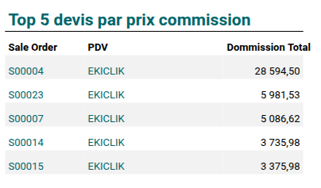
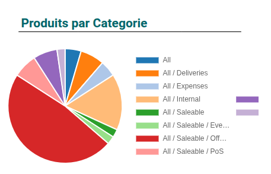
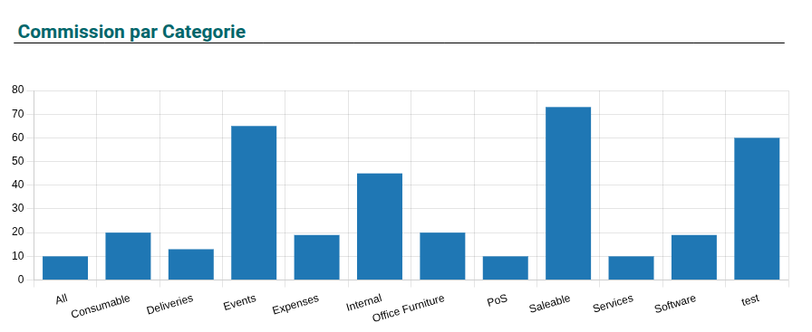

# 🚀Building an Odoo 17 Dashboard: A Guide with Code and Lessons Learned

This guide shares my experience creating a custom dashboard in Odoo 17 using the spreadsheet module, including a complete JSON configuration for a "Commission Dashboard." I struggled to find clear resources online, so I'm sharing my code, key concepts, and mistakes to help others avoid the same pitfalls.

## 🧩Overview
The dashboard displays:
- 📊 A **bar chart** for commissions by product category.
- 🥧 A **pie chart** for product counts by category.
- 📋 **Tables** for top 5 sale orders, top 5 products by commission, and all sale orders sorted by commission.


## 🔑Key Attributes in Odoo 17 Dashboards
Odoo 17 dashboards use the spreadsheet module, with a JSON structure defining layout, data, and visualizations. Key sections include:

- **sheets**: Defines the dashboard grid (`rows`, `cols`), cells (`cells`), and charts (`figures`).
- **cells**: Contain text, Odoo formulas (`=ODOO.LIST`, `=ODOO.PIVOT`), or links (`odoo://view/...`) for drill-down views.
- **figures**: Define charts (e.g., `odoo_bar`, `odoo_pie`) with position (`x`, `y`), size (`width`, `height`), and data (`metaData`, `searchParams`).
- **lists**: Fetch data from Odoo models for tables (e.g., `sale.order`, `product.product`).
- **pivots**: Aggregate data for charts or pivot tables.
- **styles**, **borders**: Format cells for readability.

## 📋How to Create a Table
Tables display data from Odoo models using the `lists` section and `ODOO.LIST` formulas.

1. **Define a List**:
   ```json
   "lists": {
     "1": {
       "id": "1",
       "name": "Top 5 Sale Orders by Commission",
       "model": "sale.order",
       "columns": ["name", "pdv", "commission_total"],
       "domain": [["commission_total", ">", 0]],
       "orderBy": [{ "name": "commission_total", "asc": false }],
       "limit": 5
     }
   }
   ```
   - `model`: Odoo model (e.g., `sale.order`).
   - `columns`: Fields to display.
   - `domain`: Filters (e.g., `commission_total > 0`).
   - `limit`: Number of records.

2. **Reference in Cells**:
   ```json
   "B21": { "style": 2, "content": "=_t(\"Sale Order\")", "border": 2 },
   "B22": { "style": 3, "content": "=ODOO.LIST(1,1,\"name\")" }
   ```
   - Use `=ODOO.LIST(list_id, row_number, column_name)` to fetch data.
   - Apply `styles` for alternating row colors.


## 🥧How to Create a Pie Chart
Pie charts visualize grouped data (e.g., product counts by category).

1. **Define in `figures`**:
   ```json
   {
     "id": "a7b9c2d3-4e6f-4a2b-8c3d-9e0f1a2b3c4d",
     "x": 520,
     "y": 500,
     "width": 475,
     "height": 230,
     "tag": "chart",
     "data": {
       "type": "odoo_pie",
       "metaData": {
         "groupBy": ["categ_id"],
         "measure": "prix_commission",
         "order": "DESC",
         "resModel": "product.product"
       }
     }
   }
   ```
   - `type`: `odoo_pie`.
   - `groupBy`: Field to group by (e.g., `categ_id`).
   - `measure`: Metric (e.g., `prix_commission` or `__count`).
   - `resModel`: Odoo model.

2. **Tips**:
   - Use a numeric `measure` for meaningful insights.
   - Set `legendPosition` to `right` or `top` for clarity.


## 📊How to Create a Bar Chart
Bar charts display aggregated data (e.g., commissions by category).

1. **Define in `figures`**:
   ```json
   {
     "id": "c4f8e9a2-3b5d-4e1f-9c2a-6d7b8e9f0a1b",
     "x": 70,
     "y": 100,
     "width": 900,
     "height": 300,
     "tag": "chart",
     "data": {
       "type": "odoo_bar",
       "metaData": {
         "groupBy": ["name"],
         "measure": "commission_amount",
         "order": "DESC",
         "resModel": "product.category"
       }
     }
   }
   ```
   - `type`: `odoo_bar`.
   - `groupBy`: Field to group by.
   - `measure`: Numeric field.
   - `order`: Sort bars (e.g., `DESC`).

2. **Tips**:
   - Ensure `measure` is a valid numeric field.
   - Adjust `width` and `height` for visibility.


## 🔄Common Mistakes I Made (So You Don’t Have To )
  - ❌ Using non-numeric fields as measure — charts won’t render!

  - ❌ Forgetting to define styles — unreadable tables ahead!

  - ❌ Not using __count in pie charts — ended up with zeros 😵

✅ **Lesson learned**: Always test each section in isolation before combining them.


## Contributing
I’m sharing this so that we can build a better Odoo dev community 💪. If you have improvements, ideas, or dashboards to share — let’s connect! Fork the repo, drop your JSON, or message me directly.

Happy coding! 🚀

